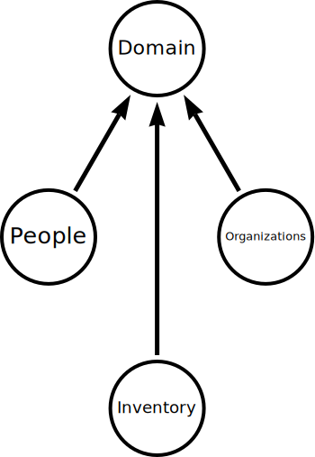

# CIM: Composable Information Machine

# The Problem
Computers are fantastic things. We have ways to configure a machine to process information.
We have been using them for decades. The need has arisen not only to manage what I put on a single machine, but now how to connect all of the "information" that exists on that machine, as well as all the information I have scattered around in "apps" and "communications" into a structured system where I am able to access all the information I have collected into a new kind of machine, the "composable information machine".

By machine we imply that we have a collection of parts that make a new whole and the sum is greater than it's parts.
This is a manifestation of the transition from paper to... something else.
Honestly, I don't think we have arrived at what that is yet. It is somewhere between blocks of data living on the internet to an image I have on my phone.
We use the term "phone" here very loosely. We are referring to an identifiable personal communication device carried by a human.
At one time we carried "brief cases" and backpacks around filled with critical papers and books.
Then we started cramming these into a portable computer, but all these are still very fragile representations of the knowledge we amass as humans.

Technology has accelerated to a point where everything is available, but how do I even access it.
We have turned into human routers moving information from one information store to another... manually.
And the big tech companies reward us by tracking everything we do and exchanging that information to sell us things.

If I am to create and manage a business today, it is quite impossible to do much without the use of information stores.
If *you* are that information store, then you are the catalyst for all information movement.
When I delegate that to a machine, I can accomplsh more, but I have to manage the machine.

When we had a single machine and information only existing on that machine it was a bit easier to manage.
Now we have information scattered all over similar to how paper reside in corporate vaults and government agencies and if we need physical access to it, we have to go there to get it.

So far, we have been modeling our new information stores the same way, the corporate vaults are the cloud tech companies and we still have to navigate government interactions, though now over the "web". The same with my bank. I don't get paper for anything other than "archival" and regulatory purposes. I get a bunch of live information, but it gets scattered over email, live document downloads, notifications and voice communications.

As a single individual, this has become fairly difficult to manage, and no one is really teaching us how to do it.
As a business or family, this is quite time consuming and we are at the mercy of "big tech" to manage our phones, our applications, and access to our information.

Just managing pictures from a handful of phones becomes something we at least have to think about if we want to be able to share things.
Who is managing those phones?
Now move that to who is managing all these laptops and servers in my business.

I can assure you that nothing currently "manages" all this, *you* manage it, probably in your head most of the time.

Sure there is software you can manually populate that does all this, but *you* are still left with figuring out how to do it.
Software has gotten smarter, and now we have a complete revolution coming with AI agents.

We are well beyond how do I manage a laptop, create information, store it, maintain it, back it up, restore it when it breaks, and share it on time with all the people and organizations who need to have that information in a timely manner.

There are a thousand Youtube videos that will tell you how to manage your "notes" and put them into some organized way of thinking and retrieving information.

# The Solution
This is all fantastic, but how do I make an "information system" today.
Not just one appropriate for an indivudual, but also one that can scale up independently and securely to manage a giant corporation.

I need two things: *Inventory and Configuration*

Inventory is a collection of all the things I have at my disposal.
Configuration is how I assemble those things into something.

We need this to make a repeatable pattern and one that stands outside raw technology that helps us understand how we are assembling the technology to create an "information machine"

We need this thing to be "composable", meaning we have to be able to assemble it from parts.

You may ask yourself, isn't this re-inventing the wheel? sort of, we see it as introducing a round wheel as oppossed to all the square and octagonal wheels we are seeing in the industry.

We already have ways to assemble hardware and software, not only to create a single machine, but to create unlimited numbers of machines.
There is no argument that we already have the tooling to do this, the problem above becomes self evident the moment you ask yourself, where did that information come from and how do I verify that it is correct. Not just now, but in 10 or 100 years.

We archived paper for hundreds of years for a reason, we will do the same with "digital information" but how will I even store this for longevity.

Here is how we see it:

There is an Object Store
This Object Store is an encapsulated pile of bits.
There is and Event Store
This Event Store is the transactional record of the Object Store

These two go together and anything that has happened in the object store is identified by a transactional record in the Event Store.

That is our portable structure:
Object Store... a simple pile of bits, separated into logical blocks, and indexed by both a hashed ContentID and a Name.
Event Store... a transactional record of changes to the Object Store.

Workflow:
Transaction begins
object is added to the store
object is stored as a sequence of hashed blocks identified by a merkle dag
the root block identifies all the dependent blocks by id
the addition event is added to the Event Store as a sequenced message for this Object Store
Transaction ends
success or failure Event is published

and that is it.

The Object Store stores the bits, The Event Store tells us what happened in the Object Store.
They are intrinsically linked together and require functionality to perform the transactions.

CIM is the technological architecture to perform this.

Assembling an information machine means this:

I have several Object/Event Store pairs that need to communicate with each other and perform functionality on the information they contain.

My "compute" resources are no different, they need to access information and perform actions based on that information.

I will need to know, with precision, what is my inventory and how is that inventory assembled to provide information.

This sounds simple, executing it becomes quite cumbersome.

So I start with a developer laptop and extend.

I should be able to recreate everything I ever do inside my "information machine" if I choose to persist it, we do know that we can skip a whole bunch of steps that we may not want to repeat of we save them in a format that can be read and user for creating our system as well as maintaining it.

Recall, an "information machine" isn't just the parts, but how we intend to use those parts and make sense of them.

We have this pile of configurations, but how do I know they are assembling correctly and will work as I intend them to.

Now we have embarked on building something real.

I need to carve out a space in the universe for my information to live.

This is what we will refer to as the Domain.

A Domain is simply a name and a space within which to perform work.

We will call the Domain "cim" and the space a network.

A network is identified by ID.
192.168.1.0 is a network address, but we don't know how big this space is yet.
we tell it how many parts we need with a number called a cidr address, an integer from 0 to 32.
192.168.1.0/24 says we want 0 to 255 total nodes or 192.168.1.0 to 192.168.1.255

This is our working space, these numbers from 0 to 255

Some of these are reserved:
0 is the network identifier and not a usable "host"
255 is the "broadcast" identifier and not a usable node.
1-254 are numbers we can use to identify our "network" nodes, or places for compute resources to live.
We will be mapping all these numbers into meaningful names as we proceed.

How you associate the names to numbers is not specified, but we will specify a pattern to use.
We will discuss how we use these numbers inline and not break out into proper network design here, but leave that as a rabbit-hole for you to explore.

All we need to know right now is that we are working on a Domain called "cim" and it lives at 192.168.1.0/24
We also have something we need to declare for naming, and that is a fully qualified domain name (fqdn).

In order for information to live on the internet, it needs an identifying address, this is the fqdn.
```yaml
domain:
  name: cim
  fqdn: cim.example.com
  uuid: 511a1ab2-451e-4e90-bc1d-014efa797046
```

With this we have identified our "composable information machine"
This is something unique to the internet through the fqdn as well as internally with a uuid.

We need an fqdn to make certificates for security, it is the current way we *MUST* identify ourselves uniquely on the internet.
We can generate these certificate locally, know as self-signed, or we can use a well-known provider to get independently verifiable certificate.

We will be using a service called [let's encrypt](https://letsencrypt.org) to create certificates on a fully qualified domain we control.
>To enable HTTPS on your website, you need to get a certificate (a type of file) from a Certificate Authority (CA). Let’s Encrypt is a CA. In order to get a certificate for your website’s domain from Let’s Encrypt, you have to demonstrate control over the domain. With Let’s Encrypt, you do this using software that uses the ACME protocol which typically runs on your web host.

We already have software requirements and we have just started.

# VHosts
Virtual Hosts (VHosts) are machines that host other "virtual machines"
This starts getting rather complicated...
the VHost itself should do nothing more than serve other machines, and I should be able to move those machines around to other VHosts at will.
Where does the information on those "other machines" get processed.

This is where we introduce an actual "composable information machine"
Composable means I have a way to connect several VHosts running several virtual machines into a single coherent "system"

That is the basis of cim-start.

These "machines" are in [compute](./compute/readme.md)
We should be able to put any "compute" resource onto any "vhost" with the same "architecture system", meaning x86, arm, etc.

CIM is how we manage all these "Object and Event Stores" and shuttle information between them.

So I have a Domain, and an fqdn, where do we go from here?

Edit [domain.yaml](./domain.yaml) and start building resources.
enter your real info:
domain:
  name: Sebastion
  fqdn: cim.sebastion.org
  uuid: a7fc949a-6429-4f4d-a51a-4a10f2a86283

This would be a cim for all of Sebation, how you describe Sebastion is obviously up to you, for us this is our demonstration site.
Sebastion is a secure way to store any information and process it with a cim.
It will walk you through how a real world cim is suppossed to look and be useful.

Sebastion needs several things in order to be able to function.
It needs:
Inventory
People
Organizations

Inventory starts at domain.yaml and proceeds to the git repository created with this template.

Let's get the template and get started with real information:

Here is our destination:


Inventory:
  Dell Precision 7750 Laptop: extenally managed (in a different git repo)
  Dell 7920 Workstation
    ServiceTag: xxxxxxx
    128G Ram
    0.5T nvme /dev/nvme0n1
    1T   nvme /dev/nvme1n1
    Network:
      enp0s31f6: 1G
      enp2s0: 1G
      enp23s0f0: 10G
      enp23s0F1: 10G
    GPU:
      nvidia RTX 3080

This is our VHost, it will pass thru the resources needed for any virtual machine or container running on the vhost and broadcast statistics
It's configuration is in [vhost-dev flake](vhosts/x86/vhost-dev/flake.nix)

This has a single NixOS configuration, "vhost-dev".

so we already have an issue... how do I name these things without generic conflicts?
That is a convention we need to establish and document, we have done this in [./example](./example)

People:
who is running this circus?
the yaml files are simple key value pairs of a name and a uuid.

This is acting like a database until we actually have one.

We need to know who is involved and what they do.

even if it's all a single person, we still neeed that reference.
To avoid naming conflicts, we use a name/uuid pair to associate them.
We will create a convention for the domain to use in rezolving conflicts by context.
We can certainly deal with two "Jane Smith"s even if they are both used in the same context.
uuid is simply a convention. We are in actuality creating axioms for our domain:

Domain is our overall container, it is described by a name, fqdn and uuid.
Domain consists of relationships between People, Organizations and Inventory.

Domain is the thing that holds all our rules for information.
We can recreate the Domain with these rules which we will call Policies.



People, Organizations and an Inventory relate into a Domain to serve a specific purpose.
Our information Machine is a reflection of those relationships and events.

We need to populate our base information, then this information generates the information machine we wish to interact with.

Domain.yaml becomes
```yaml
domain:
  name: Sebastion
  fqdn: cim.sebastion.org
  uuid: 016ada85-7dda-4464-817b-5ebcb4874ea5
```
get the uuids from [online uuid generator](https://www.uuidgenerator.net/) or any other suitable tool.

Add some people with name/uuid pairs as well as the organizations you interact with in this cim.

People:
  You
  Others

Organizations:
  Your CIM
  Your Business
  Your Domain Registrar
  Let's Encrypt
  Cloudflare
  Starlink
  Other Vendors and Providers

We have to have a basis for these even before we start adding databases, because databases need to get populated and we need a relationship that leads back to the Domain at all steps.

People and organizations should be simple, name/uuid, done.
Inventory starts getting more messy... now I have hardware vendors and other relationships to add.
Like Dell... we said this is eqipment from Dell, I want to add that organization and setup my warranty accounts.
Same with Starlink and billing.
These all need to get added somewhere and if we don't plan it, it gets lost.

Accounts all get linked to the Organization, we don't care what you use to actually hold the account information.
We will be creating some of these o a password vault so we don't want to setup accounts and things like that yet, just an identifier we will use to link these and a way to add more of them.

Before we can really *DO* any of this we need a place to do it and that is the Inventory, so to avoid our "catch-22" zand circular dependencies, we make some identifiers for our information categories.

Well, that got complex fast... yes, and now we dive into the giant rabit hole of Inventory.
Inventory is *ANY* resource the Domain has access to.
When the Domain is asked to search for something, who made the request, how is it all delivered, that sort of thing.

"Computers" already do this, but *where* they do it is usually not managed, we are left spelunking log files on many machines trying to figure out what happened?

A "Composable Information Machine" by contrast, knows all about itself and how to "self-assemble".

This is why we are making all this low level text information. It is going to become the equivalent of DNA. A pattern to follow to generate something useful.
When I need to assemble a "leg" with DNA, I get instruction and those instructions are variable based on environment. That is the methodology we are after with information construction.

Right now, all our information is text and git is managing all the changes.

From the time we instatiate the template we are assembling our Domain.

We cloned the repository.
That was our first event as a Domain.
Next we make some changes and commit the repository.
This makes some entries in git that track what is happening.
We simply continue this methodology forever.
We have a starting "state" we make changes and the changes are committed.
We have arrived at a new state.

Managing that state is what we are doing, guiding it to be able to provide our information goals.

