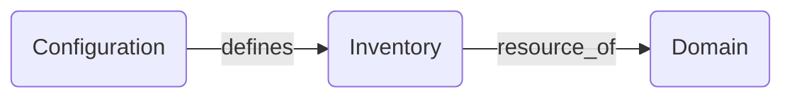

# CIM Compute
This area is where we define the connected systems and their deployment schedules.

There will be many Compute resources we need to define, some of them will have their own network to interoperate similar to a kubernetes pod.

We have the following default architecture:

dev
- development system
dns
- domain naming (not just 'dns' other names as well, such as CID names)
nats
- the way everything communicates and is authorized for the CIM

These three make up the Domain core.

We don't really want to deploy everything at once, because we may have different resources for different domains and we don't want to make them dependent on a single launch vehicle.

We DO know that for a CIM, we need NATS and DNS to do our bidding and create a secure network.

This is our Development Platform.  We will set this up to do all our testing and deployments.  If the tests all pass, deployment to Production happens, then gets tested again before making the IP public.

This environment is where we work with our Domain Objects to setup the correct relationships and workflows.

Bear in mind, we can create services in their own git repository and bring them in as a resource to the domain through inputs. Inputs must have valid hashes either in nixpkgs, or one you provide. This is how we validate a construction.

Anything Nix builds, is available in the Nix Store.

Everything in the Nix Store is immutable and hashed... In other words, it can never change in the labelled version.

This may seem odd at first, but we have been successfully doing this for decades with read-only executables in a chroot jail and user data in a mounted volume. Perhaps you never needed to do this, but it makes the system virtually unhackable if it is read-only.

Hacking is essentially exploiting things that are left exposed in which the system does not primarily use - Executing the package manager to install something or using an open port to talk to the console. If there is no package manager, and no shell, and no ssh... good luck not getting seen.

We will not be bold enough to say this system is "unhackable" that would be most arrogant, there are many ways to exploit systems, but if we close all the doors and lock them, it becomes much easier to manage.

Let's say I have a "microservice". We can debate what that is for a minute. According to wikipedia it is:
>"An architectural style in software engineering focusing on providing discrete services rather than a monolithic design."

and that is where we will leave it. CIM is a collection of microservices design to fulfill the needs of a domain.

We have discrete services, meaning they do ONE THING.

This could mean your entire accounting system, but it also mean that it ONLY does the accounting and not user management or invetory control.

>"It can scarcely be denied that the supreme goal of all theory is to make the irreducible basic elements as simple and as few as possible without having to surrender the adequate representation of a single datum of experience." - Albert Einstein

We are working towards a fully categorized domain.

We will end up with several deployment patterns, which will be used in different contexts.

Deploy to local metal
Deploy to Azure
Deploy to Digital Ocean

All will have slightly different meanings and we want to be able to have a consistent, abstracted configuration that doesn't know about where it is deployed, only that you CAN deploy it.

## NixOps
Note: NixOps is currenltly stable at version 1.7, but is undergoing a complete rewrtite as [NixOps4](https://github.com/NixOps4/NixOps4). We will convert to NixOps4 when it reaches a stable version.

NixOps is our tool for building multiple systems that deploy together.
We casn also use [terraform](https://github.com/terranix/terranix), but for now we are sticking with NixOps.

While this could deploy entire Domain at once and propably should until it reaches a certain size, we want to make our configurations in a way they can stand alone and be reused.

Reuse may only mean Development Environment and Production Environment, but that is indeed reuse and we need to be able to determine what was approved in Dev is exactly what we deploy to Prod.

For the rest of this initial configuration, we will target local metal, meaning a stand alone server you own. We will follow that with a complete DigitalOcean deployment, but this will cost you monthly fees.

Local Metal can be just about any machine you can make run as it is for development purposes.  We will walk through what that means and how we do installation and deployment for bare metal.

For Nixos, it really just means we also have a hardware-configuration.nix to add to our flake.nix.

This can be created automatically, or we can use some manual steps to install from iso.

Ultimately, we want a system that can detect something is plugged in to the network and configures itself, but that will come later.

Right now we have to establish a Domain, this means at least one machine running and supports a developer environment, dns and nats.

## Inventory
Every resource, whether it be hardware or service contract is available through Inventory. This is a Bounded Context of anything we have use of as a resource.

You will most likely split this into sub categories as things grow and for separating authorization, repeatability, price modeling, monitoring, etc.

We are here:

Configuring hardware can be difficult. There is a sub-topic devoted to it for reference to how to go down the hardware rabbit-hole.

We aren't trying to define a better way to define things, just the fact we are, and we are organizing it by subject.

We have two choices now:
- boot from media
- boot from network

making media is a simple redirection of the configuration we already have.