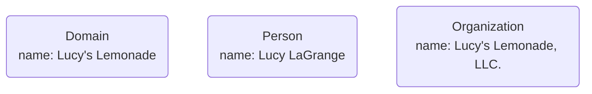
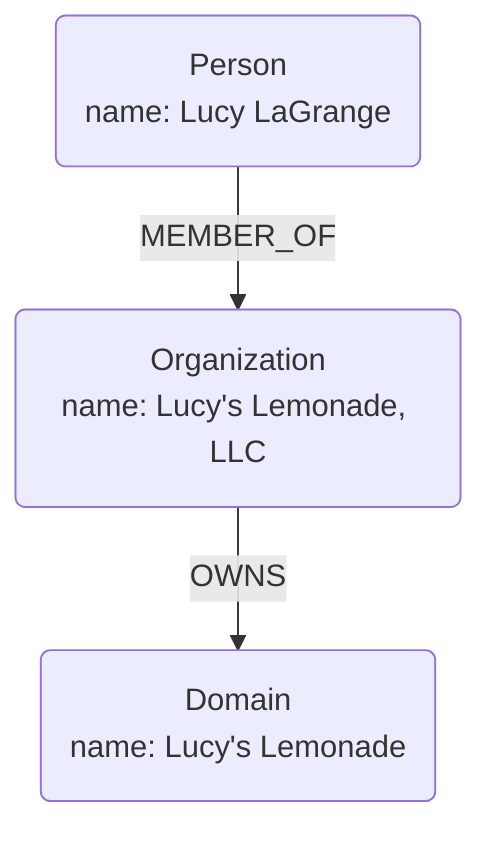

# Domain
Domain is a model of your business, think of this as organized functionality.
It doesn't know anything about it yet.
We create a Domain and add parts to it as we go.

As we collect those parts, we prepare them for transition into a CIM - Composable Information Machine. This machine concentrates on a single Domain, though it can connect to other Domains. This is an intentional partition. A Domain is a define encapsulation of Business functionality. This can be a whole company or a part of it.

In Domain-Driven Design (DDD), the concept of a "Domain" is central to understanding and organizing the complex realities of the business environment that a software system aims to model and solve. A Domain in DDD terms refers to the subject area to which the user's business rules apply; it is the sphere of knowledge and activity around which the business's interests revolve. Here's a breakdown of the concept and its significance in DDD:

1. Domain Scope:

The Domain encompasses everything related to a specific business's problem space, including the data, the business rules (or logic), and the actors (both human and system) that interact within this space. It defines the boundaries within which the software solution operates, targeting a specific area of interest or business need.

CIM treats this as a unique system.  You aren't bringing other systems into your Domain, you are simply identifying how you create them, use them, and communicate with them. We can talk about "architecture" but the Domain Model will reveal that.

2. Ubiquitous Language:

One of the key principles of DDD is the use of a "Ubiquitous Language" that evolves within the Domain. This language is shared by both the business experts and the development team, ensuring clear communication and a shared understanding of the Domain concepts, terms, and processes. It helps bridge the gap between the technical implementation of the software and the business requirements it seeks to fulfill. CIM automatically creates this language based on a Graph of the business model and extracts words and their context in the background. We also have 2 Object Stores already, the Nix Store inside our Environment and the Object Store in git, with permission, we mine those too.

This enables a Model's interaction with AI and Semantics to best utilize our natural language tools.

3. Subdomains:

A complex Domain often consists of multiple "Subdomains," each representing a distinct part of the overall Domain. These Subdomains are categorized into:
- **Core Domain**: 
  - The primary focus area that provides strategic value and competitive advantage for the business. It is where the most significant business rules and processes reside.
- **Supporting Subdomains**: 
  - These provide necessary support to the Core Domain but do not offer a competitive advantage. They still require custom development to meet specific business needs.
- **Generic Subdomains**: 
  - Areas that can be handled with off-the-shelf solutions or generic software components, as they do not contain business-specific logic or processes. We replace these components through a "fitness function". The fitness function declares what the business uses the tool for and the criteria or functionality required from the tool. This way any tool meeting said fitness function is eligible as a substitution for that tool.

4. Bounded Context:

A "Bounded Context" is a boundary within which a particular Domain model is defined and applicable. It is a logical boundary that separates different parts of the system, where the same word or term can have different meanings in different contexts. Bounded Contexts are crucial for managing complexity in large systems by ensuring that models within a specific context are internally consistent but can vary across contexts.

5. Domain Model:

The Domain Model is a conceptual model of the Domain that highlights the most important concepts and relationships within the Domain. It is typically built in collaboration with domain experts to ensure it accurately represents the business rules, processes, and entities. The Domain Model serves as a blueprint for the system's design, focusing on the business's needs rather than the technology used to implement the system.

In summary, the concept of a Domain in Domain-Driven Design is foundational to understanding and effectively addressing the business's complexities through software. It emphasizes a deep engagement with the business experts, a shared language, and a strategic focus on modeling the business accurately to create effective and maintainable software solutions.

Sage is here to help you create that model and build a system to understand your business and to make it function as expected. Whether you are starting from scratch or you already have a model, we will be mapping a new Domain Model that operates a Composable Information Machine.

We start with a blank slate and bring in the Domain as we create it.

Sage will then be able to extract Model metadata as we add information and relationships.

Our Model will start small and specific and grow with us.
We can import data and other models as we go. This system is designed to be evolutionary.
You can build it one node and edge at a time, or you can import models from other tools such as [Arrow.app](https://arrow.app) or graphviz dot files.

## Primary Focus

### Domain

Domain is always the primary focus here. We add supporting elements to describe the Domain.
Everything leads back to Domain as the purpose of our CIM.

Let's create the Domain:
```json
{"Domain": {"name": "Lucy's Lemonade"}}
```
We want a uuid...

```json
{"Domain": {"name": "Lucy's Lemonade", uid:"077259b3-8a59-4154-8953-ea17cbb2ba3d"}}
```
we also want a fqdn...

```json
{"Domain": {"name": "Lucy's Lemonade", "fqdn": "lucyslemonade.org",uid:"077259b3-8a59-4154-8953-ea17cbb2ba3d"}}
```

We are using JSON as a universal language for messaging. Today it is the defacto standard, but feel free to use anything you prefer. We know we are going to translate things a lot and mostly they end up in JSON.

Here we have a uuidv4.  This is an important thing to know. There are already two other ID formats we have talked about: ContentID and CommitID. CommitID is just like the uuid, except it uses Commit hash as input and the CommitID incorporates the Content in creating the ID.
ContentID does a couple extra things. I have the same sort of hash that is a CommitID, but I also get some Type information as in a schema definition via IPLD. This Content-Address is valid universally, it is reproducible, so it can be used as a validator, and it points to the ID of a Node in a Graph containing the data.

These have very different uses, but we will be using them all frequently in a CIM.

Content Based IDs are essentially "natural keys" and if the content changes, so does the ID.
Sometimes that is exactly what we want...
Even in a situation where A replaces B and ContentID is different for some reference to B.
This is where our Event Store comes into play.

Object Stores are immutable (or at least they are supposed to be.)

If it's immutable how do we update it?

We update via whole replacement of invariants.

If they go together, they are replaced together.

If A is replacing B, there is an Event showing the progression.

Starting with an empty Object Store, we add something to it and that is stored as a transaction in the Event Store.
Yes, these two are tightly coupled.
In theory, you can store the events as objects in the object store, but that gets into many weird situations splitting them prevents.

Remember, our backup pattern is simply duplication.
The system you pride yourself on is the same, even if it's microfiche, a lamp and a magnifying glass. (btw, these are the US Federal Government standards.)

We are trusting that the global information system is going to stay alive. From our Object Stores and our Event Stores, we can recreate everything. Both are immutable, and both are easily replicated both on and off line. Immutability also provides for infinite cache-ability and archiving.

Domain is the thing we are trying to model.

But who Owns this Domain?

Now we need People and Organizations.

Who are you?

This is after all a personalized system.

The more we know about each aspect of how you intend to use the system is to your benefit. That can make us really nervous, we have been told to avoid using detailed personal information, but that applies to external applications controlled by others, not a system like CIM which is totally under your control.

This system is closed and all operations are secure.
Every message is communicated with zero-trust, meaning it requires valid authentication and authorization at every step. This is YOUR information not anything we can mine behind your back.

We designed this information system specifically to encapsulate a Private Domain with all it's intricacies and feel safe no matter where it's hosted due to the nature of the architecture in which it is built. Personal information is highly guarded and requires security to access.

We are going to have many things that live inside the Domain. Our focus is on how they are related more than how we focus on the details of the information for now.

People are an external force that we contend with to build a Domain. So are Organizations, these things exist outside our Domain, yet we are related to them intrinsically. We also have the concept of Agents. Agents act like people, but aren't, they may be totally driven by a human, completely autonomous, or a mix of both.

Now we have our first problem to contend with:
Requiring a unique name is going to be a problem...
It's a problem because we experience in the real world, many people with the same name. We can try all we want, but the fact that there are some 10 Billion people to consider, name collisions are unavoidable. In that same vein, what is a name? Can it be vocal only? Some single symbol?

It's not that we want to find a magic solution that will fix this, we want to establish how WE deal with it in our Domain.

It may be perfectly acceptable for us to force users adding new people to require a unique name, but is that true for people outside our Domain? No, it's not, so we will need to do something about that.  We can assign an ID and that is the traditional method for doing this.

We want "People" to describe what exists and is important to us.

We also need to cover some constraints that will make our Domain operate efficiently.

To create a Person:

Use the entire name, we will make a ton of metadata around this.

So we don't get any collisions, let's add a uuid:
```json
{"Person": {"name": "Lucy LaGrange", "uid": "753e35f3-25bc-49ba-aeb6-068baee5f66b"}} 
```

Hopefully, you are starting to see a management problem. How do I create the IDs?
If I did all this in a database, I have to back all that up and relate it to everything else. Storing these in files alone is going to also be a problem.

By semantically relating all this to a Domain and making it live in a Canonical Messaging System we eliminate a ton of those worries.

We need a Fully Qualified Domain Name in order to use the internet effectively.

```json
{"Person": {"name": "Lucy LaGrange", "fqdn":"lucyslemonade.org", "uid": "753e35f3-25bc-49ba-aeb6-068baee5f66b"}} 
```

Think of this in the real world:

My database died... like, the hard drive died.
ok, no worries, we take the configuration and deploy to a new instance:
- the instance comes up empty
- it starts a subscription to it's Event Stream and is back online
- it runs a "catch-up" subscription for all events we want in the database
- it repopulates itself 
- nobody had to change anything in the Messaging system, it just kept going.

This is a bit different than restoring database backups and hoping they work.

In our Domain, We are instantiating our base, and to do that, we just need to create some loose information and trust that we will be adding constraints and relationships as we go.

This is all getting stored in git as we proceed. As we need it, we will create environments and services to connect the Domain. You could literally do this with a bunch of sticky notes, and we loosely follow that model, we have a bunch of disconnected things to evaluate and define relationships around. Doing this electronically is going to create a digital twin in which we can collaborate as though the Domain is real, because in fact, it is.

Next we create our Organization.

```json
{"Organization": {"name": "Lucy's Lemonade, LLC.", "uid": "79137452-6e75-44f0-8ca1-a03139bd08de"}}
```

Our model is expanding.


Now our model looks like this:



Rather uninteresting so far.

Now we want some relationships.

LLCs have members...
Now we need to distinguish a Person is a Member in an organization and that organization is an LLC. Other constructs have different nomenclature such as Shareholders and Officers and we want to reflect that. Our objective is to stay as close to natural language inside the Domain as possible as we define our system.

Nodes are Nouns and Relationships are Verbs.
Furthermore, Past tense are Events, Present tense verbs are either Command or Query 

Relationship may seem a little weird at first, here is our definition:
Relationship has a Type as its Name
First Node Reference is Direction From
Second Node Reference is Direction To 

```json
{"MEMBER_OF": 
  {"Person": {"name": "Lucy LaGrange"}},
  {"Organization": {"name": "Lucy's Lemonade, LLC."}} 
}
```
This is applied as: Lucy LaGrange MEMBER_OF Lucy's Lemonade, LLC.

And the Organization owns the Domain.

```json
{"OWNS": 
  {"Organization": {"name": "Lucy's Lemonade, LLC."}}, 
  {"Domain": {"name": "Lucy's Lemonade"}}
}
```
This is applied as: Lucy's Lemonade, LLC. OWNS Lucy's Lemonade

Now we have some real information we can use to build something.

> There exists a Domain called Lucy's Lemonade, it is owned by Lucy's Lemonade, LLC. of which Lucy LaGrange is a Member.

That is our initial Domain.

Order doesn't matter here. In other words, we can build meaningful expressions from different perspectives:

> Lucy Lagrange is a Member of Lucy's Lemonade, LLC. which Owns the Domain Lucy's Lemonade.

> Lucy's Lemonade, LLC. is an Organization consisting of Lucy LaGrange and owns a Domain called Lucy's Lemonade.

And now AI can decipher all of this and make sense of the relationships.




We don't even have properties yet, consider those the Adjectives and Adverbs.

From here we expand on this notion with other relationships and Domain Objects.

There are several tools we make available to assist you in this journey.

When we establish an Organization, we should have an idea of what this organization does and for that we use the Value Proposition Canvas to build our sections related to business functionality and how we work with customers.  If we model this directly into the business model, then it is never "lost" and context is always available for us to use it.

If this seems tedious, it is.

We however, encourage you to only import things that actually exist and are used instead of trying to duplicate things you already have.  In other words, don't import your entire mail system just to create users. Many of them will never participate here and we should try to reflect that.

You may connect to any other external system and develop a continuous integration to that content, we will get to that soon.

Before we can create our Infrastructure Model for the CIM which are all the Entities, Values, Policies and Behaviors we will be using that operate through collections of Commands, Queries and Events organized into Transactions we call Aggregates, we will have to make some more base definitions around the Domain.

These are the Domain, the Organizations, People, and Things related to that Domain.

Domain things move from any creation tool (such as Excel or Text or Documents) into the Domain by relationship. If we need that data, we capture it, if we just ephemerally point to it (like a url), we do that.

CIM is an organizational tool for business functionality. The programs you use do not matter as much as what they are used for in terms of business functionality.  That business functionality relates back to your Business Model Canvas which is a collection of your Business Resources and the Value Propositions for reaching customers.

We have absolutely magical technology available to us, but if we cannot relate that back to a single business purpose, then we are lost.

This is why we focus on the business model and generate or commission software from that, rather than shopping for software and then modeling our business process around that. We collect these into Domain Artifacts that allow us to recreate everything in the Domain from a set of Configurations and a sequence of Events.

[Inventory](./Inventory.md)