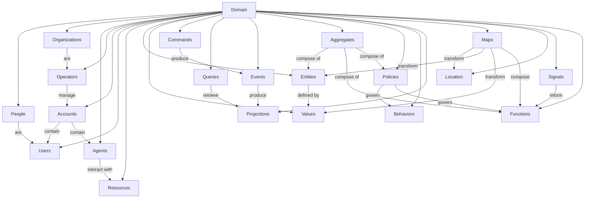
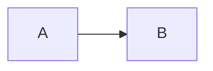

# CIM Inventory
CIM has the concept of an Inventory.
This is every resource available to the Domain.
It's not just the stuff sitting in your warehouse, it's all the Configurations and the Ubiquitous Language.

Why am I building a language? See [Ubiquitous Language](./UbiquitousLanguage.md)

Does this all require a Graph Database?

No. Essentially, the Event Store is already a Graph Database, the Object Store is also a Graph Database.

Not that they are running on top of some database infra-structure, they are simply stored on a persistence layer in graph format.

You could make this work on any file system you are comfortable using and that is what git does.  These file systems will have different limitations and we would need to worry about all those. git does all it's work in the .git folder.

If we think of files as inputs or outputs, things become a little bit more clear.  Afterall, "files" are a construct of the Operating System (OS). The OS is giving you a pile of blocks organized into a sequence you think of as a "file" which in fact, is a name pointer to a graph of blocks. It's just hidden from you.

A Node is the same thing. If a Node is collection of blocks that we have named, it's is logically the exact same thing we think of as a "file".

"File" is a convenient term brought to us from the context of Paper. This is a collection of papers we put together into a "file".

In the Information World, we can dispose of this base structure and look at the real thing: a graph of blocks. We are going to call these Content and they have a Content-Address.

As long as we consider this our inventory, we are in good shape. Speaking of shape, that is something we care a great deal about.

Shape is going to be formed by "Category". Categories are not the same thing as a group, a collection, or a set. They have their own set of ideas and axioms. When we refer to "Category" we do so in the terms of "Category Theory" and this becomes an essential part of our Inventory Structure.

Inventory for a CIM is therefore the Category of every Resource it has access to.

That is why we are starting at Domain, and then adding the other requirements. The Domain is what we care about and different Domains have different requirements.

These are the Core Categories CIMs usually have:

Woah... Now we are looking at some meat.

These are the high level abstractions that make up our Base.
You will surely have Domain Specific additions as you proceed.
We will dive into every one of these in time.

These are not contrived and they are not objects you inherit, they are things you instantiate and extend.

This becomes part of the Ubiquitous Language and will be nomenclature you are guided by and follow as you build your Domain.

As we see, the Domain is what links everything together, this is our Context, the Domain.

Each part of the Domain is what we want to navigate with impunity and confidence.

One thing at a time...

Once we understand:
  - Everything happening in A
  - Everything Happening in B
  - The transition from A to B

Then we are clear on that part of the Domain...
- I don't care about C or D or the price of tea in Jakarta.
- I care about Inputs to A, what that does to A
- Causing a transition from A to B
- And what B looks like when I am done.
- Period, Events and State Machines control that

[Communications](./Communications.md)