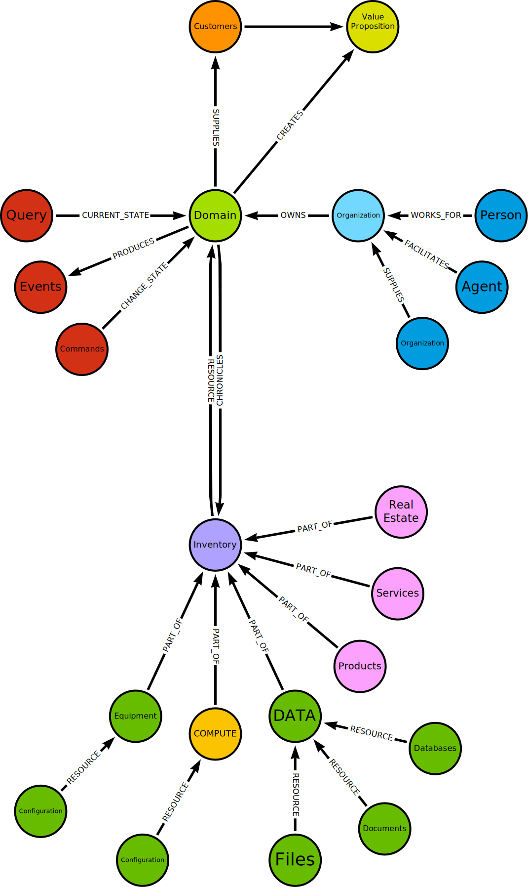

# CIM: The Composable Information Machine

CIM is an architecture designed to navigate the complexities of today's global information network, with an eye toward the future of interplanetary communication. Our world is connected through vast satellite networks, facilitating regular off-planet communication.

How would one transfer data from a thumb drive to Mars? While this may not be a current concern, it poses an intriguing question for the future.

Consider sending data from a ranch in Montana to Japan as swiftly as possible. With satellite technology, we're moving information globally using off-world innovations. Launching your own satellite has become surprisingly affordable, at $10,000—equivalent to the cost of an in-house server or a year's worth of 1 TB cloud storage in 2024. It's time to question our reliance on outdated 1980s technology built on ideas derived from the paper processes of the 19th Century.

Many of our information management techniques were developed before the advent of the internet. Since then, academia has kept pace, offering innovative solutions for enhancing our digital capabilities. Thanks to Moore's Law, both computing power and network speeds have surpassed local access speeds in many cases. However, this often leads to being locked into multiple accounts and data sources, each with its own set of complications.

Where does all this information go? Often, it's scattered across the internet, frequently under the control of various vendors without straightforward export or eventing options outside their platforms. This fragmentation presents a significant challenge.

Thankfully, many applications offer direct APIs, allowing us to integrate them into our Cmd/Qry/Evt pattern using [Comms](./comms.md), facilitating communication with any application.

Must we integrate every API individually? In practice, we're already performing this task. Our approach simplifies the process, turning API integration into a testable, automated mapping exercise. Using vendor products necessitates authentication and structured communication, which we encapsulate into configurations for seamless API access through our messaging system.

## Canonic Message Model
We aim to develop a Canonic Message Model for the Domain—a comprehensive registry of all potential system messages, acting as a functional directory within the Domain.

This model not only aids in discovering functionalities, such as handling a street address but also ensures that any entity within the Domain can access these capabilities.

Developers often find themselves redefining functionalities for common elements like phone numbers or zip codes or implementing basic data operations such as sorting and mapping. Our Domain Message Model serves as a functional roadmap for the Domain.

Traditional education on information access emphasizes a straightforward approach:
- Create a website
- Connect it to a SQL database
- Profit

While enticing, this oversimplification falls short in practice.

In reality, information access today is characterized by:
- Ubiquitous APIs
- High-speed internet
- Affordable storage
- Commodity computing

The necessity to construct a data center is obsolete; incremental, pay-as-you-go services are globally accessible. The agility to scale up or down in response to demand, almost instantly, is a modern requirement.

However, making information readily available poses a significant challenge. The traditional cycle of setting up a system, testing it, and deploying it to production, followed by inevitable troubleshooting, is outdated. Today, the focus is on configuration, testing, commitment, and letting CI/CD handle the deployment.

Moreover, managing dispersed information—whether it's about consolidating data, modifying it, or accessing it across different platforms—requires a novel approach. How do we facilitate seamless communication between disparate "apps" without resorting to extensive manual coding?

[Comms](./comms.md) solves this. 

It performs streaming blob transfer, ETL, projections, queries, and any other tasks required to access and share data across the entire domain. Additionally, it operates on a zero-trust principle, meticulously scrutinizing every message to ensure security. Comms employs certificates, ensuring that all communication is secure and encrypted. It also manages load balancing and scaling. If durable persistence is needed everywhere, it can provide that as well. Comms facilitates working with commands, queries, and events. But how is all this possible?

It's all enabled by a domain model constructed directly from a business model.

### What about the Business Model?
The term "business model" refers to a company's strategy for generating profit. It outlines the products or services the company intends to sell, its target market, and any expected costs. It can also refer to your "personal" domain where you are the business.

To enhance our understanding of the business model, we incorporate several academic concepts into its framework:
- Domain-Driven Design
- Messaging
- People
- Organizations
- Portable Content-Addressed Data
- Resource Management
- Event Sourcing
- Continuous Delivery
- Continuous Integration
- Functional Reactive Programming

Admittedly, this encompasses a broad spectrum of ideas, challenging to grasp in its entirety.

Fortunately, we have Sage — a Client equipped with a responsive AI system designed to simplify these complexities with cim-start being the backend. Sage enables you to inquire about how these components interact and assists you in developing your model. More than just a support tool, Sage acts as an interactive agent capable of executing any command or query within the CIM and responding with events. We don't mean "helping you code", we mean establishing workflows and having AI Agents write, test and deploy the code.

Let's explore an example:

This is a substantial amount of information to grasp, especially considering this is merely a foundational and incomplete example. In a comprehensive business model, there would be thousands of relationships and additional nodes divided into distinct domain parts.

Utilizing graphs for organization and translation provides a highly adaptable framework for change, ensuring both structure and discipline are maintained.

The lower nodes for IT resources will comprise a list of hardware and configurations. The upper nodes represent domains and organizations. Although not strictly hierarchical, they form directed graphs.

We utilize [git](https://git-scm.com/) for managing configurations, along with their documentation and tests. Git operates on content addresses (commits), fitting our need for portability. Interestingly, git itself is based on a graph model, reflecting a growing trend in information management.

Git resources can reside in simple object stores, allowing for maintenance without the need for GitHub or GitLab. While those platforms are optional, git is essential. Git repositories can be stored in an S3 bucket, essentially replicating GitHub's functionality with an added front-end.

With git, we have a dependable source for our configurations, regardless of their form, ensuring version control and the ability to execute commands and queries.

The process begins as follows:
1. Create a git repository anywhere.
2. Make configurations (e.g., flake.nix).
3. Commit them.

That's all we really need to get started. However, this repository as a template offers a much more progressive starting point.

Changes are saved in the git repository, allowing us to query them or integrate them into a Domain Event Stream. Git provides a reliable, portable, and version-controlled method for maintaining our configuration. For alternative repositories, ensuring content addressability and the ability to store an Event Stream of changes is crucial. Git already fulfills these requirements and is universally available.

We can start with an empty git repository and progress towards building a Domain CIM.

The Domain CIM serves as the foundation, encapsulating your business model and domain model. To ensure clarity and distribution, we distinguish between the domain model and the business model. Some business models may encompass multiple domains, while some domains may include several business models.

From this point, we can expand into submodules and projects linked to the domain model. Thanks to git's distributed nature, only replicas are needed.

This model prompts us to think about creating a cohesive business and domain model, stored in a self-contained, distributed system. This approach enables us to connect all necessary elements for a successful venture.

As we enhance the CIM, we'll develop a ubiquitous language, aiding in the comprehension and construction of your model. Although CIM is primarily an architectural concept, Cowboy AI offers a comprehensive suite of tools to facilitate the architecture's implementation.

Starting with git, we build our initial model, a NixOS Compute Environment, where we can run and test our domain model. Remarkably, all you need is a browser to access this online, eliminating the need for personal computing hardware.

You don't have to learn NixOS, we can generate flakes from the Domain.

utter magic.

Recall:
> "Any sufficiently advanced technology is indistinguishable from magic." - Arthur C. Clark

Open your git repository.

We have few files, mainly, flake.nix, sitting in a git repository and that gives us the ability to start a compute resource, we can ignore the hardware for now.

Where do I run this?

We prefer a system running NixOS. This can be a VM or Metal, Docker works but has issues.
If you have never run NixOS, or for some reason prefer not to, ANY linux system is viable running nix package manager. Basically, anywhere you can get a shell running Nix.

For Windows WSL2 see [NixOS-WSL]([htt](https://github.com/nix-community/NixOS-WSL))

If you already have NixOS installed, which is always preferred, simply open a terminal and either nix develop or direnv allow.

On NixOS we prefer [direnv](https://direnv.net/), which is part of this flake, but if it's not already there, you'll want to add it to your NixOS systemEnvironment as well as turning container support on.

## Running the VMs

### Locally
If you can, this should be your preferred method for the closest relationship to the code, but we realize this may take more resources than you have.

Just to get started, run the dev machine first.
This has a bunch of tests to make sure it deploys correctly.

### Codespaces
Codespaces currently aren't working on pure NixOS, we are working on a solution, we can do it with Alpine and nix, but even that is having issues, for Codespace you can use Ubuntu an nix-infect it.

Nix Infect is a script that allows you to install NixOS on non-NixOS hosts. It is designed to work on a variety of cloud and VPS providers, including DigitalOcean, Hetzner Cloud, Vultr, and others.

On https://github.com/TheCowboyAI/cim-start, click "use this template, and choose "open in a codespace"

We will remove the not working comment in devcontainer.json when Codespaces work

If you need another alternative:
  Docker ** coming soon...

Virtual Machines
  - run the build.sh script to build a vm
  - run.sh is convenient if you are on a nix system and want to launch the VM there.

### DigitalOcean
We can deploy these to DigitalOcean for a reasonable fee.
in this case, run ./build_droplet.sh
The only difference in this VM is that it uses a DigitalOcean specific base image.

