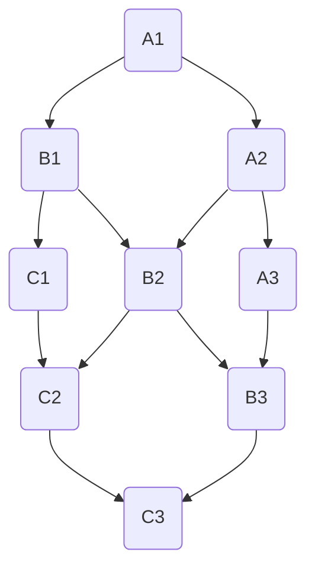
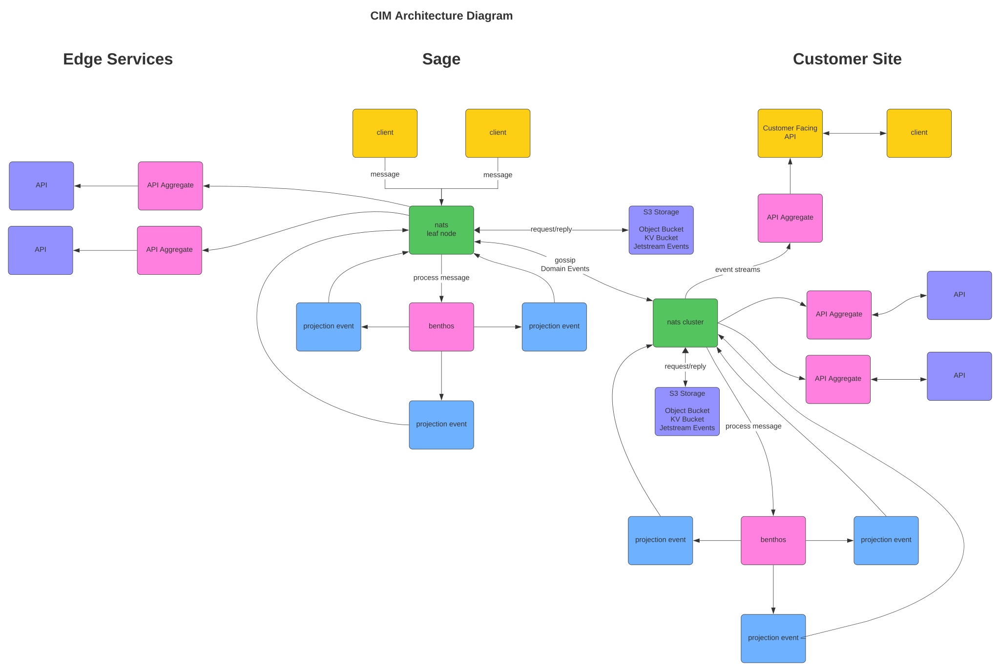
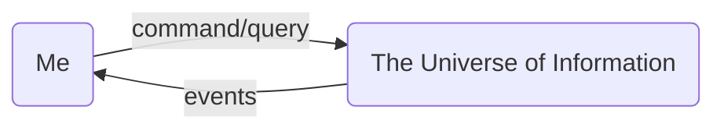

# cim-start
A starting point for CIM - Composable Information Machine.

 

We are developing an intuitive, private information system.

An information system is not simply about setting up various applications on computers. Instead, imagine it as a master blueprint for organizing different pieces of information, understanding how they connect, and ensuring they can communicate effectively, no matter the type of computers or the form of the data they deal with. It's like giving a machine its own DNA, a set of instructions that allows it to construct itself flexibly, adapting to whatever environment it finds itself in. This system doesn't just blindly follow a set routine; it intelligently assembles and reassembles itself to meet the needs of its surroundings, much like how living organisms adapt to their habitats.

 

You're likely familiar with the traditional method of organizing information: spreadsheets, with their ubiquitous rows and columns. But what if we could move beyond this limited structure?

CIM counters this with a structured graph of information where each node and edge is purposefully designed for seamless composition. We're shifting away from the conventional paradigm of location-based hierarchical files and spreadsheets to embrace a more dynamic format.

Although graphs are fundamental in areas like social media and data science, many still default to the familiar rows and columns of spreadsheets for information management. This isn't due to performance issues or a lack of comprehensibility; it's merely a matter of habit. Viewing data through a graph-based lens offers a different, and often more insightful, perspective.

CIM is designed to scale, starting from a straightforward, single-configuration setup that grows as needed. Yet, no matter its complexity, the core principle remains simple and accessible.

Looking at the spreadsheet, it is this in a graph:
Not terribly difficult to understand... and in many ways, easier to reason about

If you can put a formula in a cell on a spreadsheet, you can put one in the edge of a graph and they operate the same way.

One version of a CIM can look like this:

In a graph, nodes can represent a diverse range of elements, from complex operational systems like another CIM or a Document Repository to simpler entities such as individual strings, collections of strings, constant numbers, or generators (e.g., sensor inputs).

Within our domain, strings transcend their basic form. Each word is enriched with meaning and semantic context, similar to the deep, nuanced understanding seen in a child raised in a multilingual environment. We utilize different languages for specific contexts, where the overlap of these languages illuminates crucial aspects of idea conveyance. These overlaps lead to a unified concept or context, uncovering the patterns we seek.

While previous efforts may have touched on similar concepts, CIM distinguishes itself by shifting from the traditional rows and columns to a graph-based model. This shift enables a more dynamic data representation. Although data can still be presented in rows and columns, our domain's core structure evolves into a graph. This evolution does not make traditional databases redundant but introduces a new way of interacting with them.

CIM positions us on the brink of a future where information is seamlessly interconnected, significantly improving our ability to comprehend and leverage data.

Looking at a more developed CIM Graph, we illustrate the connection of a Leaf Node to a Domain Cluster, showcasing the system's advanced capabilities.

Starting with a browser and a git repository may seem simple, yet it's the foundational structure for a CIM. Initially sufficient, our needs will grow, demanding more capabilities and resources.

CIM represents a significant abstraction, focusing on distilling information from technological complexity. The underlying technology remains, but it's relegated to the background, allowing us to concentrate on the essence of the information rather than the myriad ways to process it. This prioritization of decision-making over process intricacies becomes the cornerstone of a successful information system.

CIM revolves around three core functions:
- **Command**: Modifies the state of the CIM.
- **Query**: Observes the current state of the CIM.
- **Event**: Signals a change in the CIM's state.

From these concepts arise questions about ownership, event storage, command capabilities, inquiry methods, dependencies, and file management. These considerations, while fundamental to an information machine, have expanded into a bewildering array of technical jargon.

However, returning to simplicity does not imply reduced functionality; on the contrary, it enhances capability.

Typically, we view computers as advanced calculators, capable yet often limited to numerical data processing. This perspective overlooks our innate human capacity for semantics, the meaningful interpretation of information. Despite our tendency to imbue everything with meaning, we rarely apply this semantic depth to our digital tools.

Consider the simplicity and clarity offered by a graph:

This continuous loop of information processing requires a method to pre-process data without becoming overwhelmed.

CIM serves this purpose, allowing seamless interaction with various systems and technologies. Previously challenging, current advancements now make it not only feasible but also advantageous to adopt such a system.

While some technologies integrated with CIM might present a learning curve, the platform is designed to facilitate learning on the go. Built-in queries to AI and the conversion of conversations into resources akin to AI-assisted meetings significantly flatten this curve. With a ready-made assistant, users can navigate the system more intuitively, even without prior technological expertise.

Sage, a user-friendly interface within CIM, guides you through designing and managing information, emphasizing the relevance of information over the choice of technology. Whether you prefer NixOS or wish to integrate Docker with Ansible, CIM's flexibility supports various technological ecosystems.

Over the years, we've experimented with numerous technologies, each with its strengths and weaknesses. However, CIM isn't meant to replace these tools but to complement them, integrating into your existing domain as a novel tool with a unique purpose.

The foundation of CIM is built on two key concepts:
- **Domain**: A defined boundary encompassing related information.
- **Environment**: A specifically configured workspace.

Starting with a basic language and understanding of domain-specific nomenclature provides a reference point. From there, CIM customizes a language suited to your domain's unique needs, simplifying complex manual processes.

Drawing inspiration from methods like the zettelkasten, CIM automates the creation of a domain-specific language, enhancing communication with advanced AI technologies.

To begin, clone the template repository and explore the possibilities CIM offers for your domain.

[using the template](./Using_this_template.md)

Copyright 2024 Cowboy AI, LLC