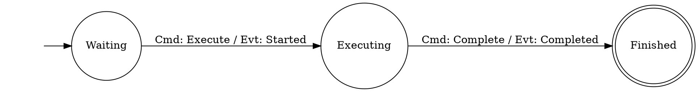
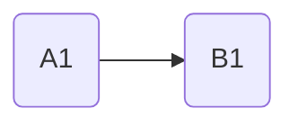

### Introducing CIM: The Future of Information Automation

#### Composable Information Machine by Cowboy AI

---

#### The Vision Behind CIM
- **Intuitive & Private Information System**: Developing an information system that prioritizes user intuition and data privacy.
- **Business and AI**: With AI's ability to quickly extract APIs and produce fully tested code, businesses can accelerate their digital transformation, integrate diverse systems more efficiently, and harness the full potential of their existing applications in conjunction with AI-driven self-improvement models.
- **Redefining Data Organization**: Moving beyond traditional applications, APIs and databases to a fully distributed and connected system that adapts and evolves like a living organism, offering a new DNA for information architecture.


<p>*Cowboy AI streamlines information integration and management.*</p>

#### Beyond Spreadsheets
- **Challenge the Status Quo**: Traditional spreadsheets have limitations in flexibility and connectivity.
- **A New Paradigm with CIM**: Introducing a dynamic, interconnected approach.
  

<p>*Most of us are familiar with a spreadsheet.*</p>

Cowboy AI moves beyond that notion to focus on state machines and relationships.



#### Scalability and Simplicity
- **Start Simple, Scale Smartly**: Begins with a basic setup, designed to grow and adapt to your needs.
- **Maintaining Core Simplicity**: Despite its complexity, CIM remains accessible and manageable.


*Graphical interpretation simplifies understanding and interaction with data.*

---

#### A Diverse Ecosystem Within Nodes
- **Rich Data Representation**: Nodes can embody anything from complex systems to simple data types, offering a versatile foundation for information processing.
- **Language and Semantics**: Emphasizing the importance of context and meaning in data, transcending traditional data storage methods.

 *An example of CIM's flexible and diverse information structuring.*

---

#### The Core of CIM: Dynamic Data Interaction
- **Foundation in Flexibility**: Shifting from static databases to a dynamic, graph-based model.
- **Seamless Information Interconnection**: Aiming for a future where data is effortlessly linked and understood.

 

*CIM Default Architecture*

---

#### Simplicity Amidst Complexity
- **Focusing on What Matters**: Prioritizes essential information over technological intricacies.
- **Core Functions**:
  - **Command**: Modify the CIM state.
  - **Query**: Access the current state.
  - **Event**: Notify changes within the system.

*Understanding and leveraging data through straightforward yet powerful interactions.*

---

#### Semantic Processing: Bringing Meaning to Data
- **Beyond Numbers**: Recognizing the semantic depth and potential in digital tools.
- **A Graph of Understanding**: Simplifying the complex loop of command, query, and event for clear, meaningful interactions.


*Clarifying the flow of information for intuitive system navigation.*

---

#### Integrating Technologies with CIM
- **Learning and Adaptation**: Built-in AI assists and guides through the system, making it accessible regardless of technological proficiency.
- **Technology Agnostic**: Supports various technologies, enhancing rather than replacing your current systems.

*Making advanced technologies approachable and useful for everyone.*

---

#### CIM's Foundational Concepts
- **Domain and Environment**: Defining the scope and workspace for your information system.
- **From Zettelkasten to AI**: Automating domain-specific language creation, enhancing communication and efficiency.
---

#### Get Started with CIM
- **Explore and Expand**: Begin by cloning this template repository and discover how CIM can transform your domain.

```bash
git clone https://github.com/thecowboyai/cim-start
```

*Copyright 2024 Cowboy AI, LLC*
MIT License