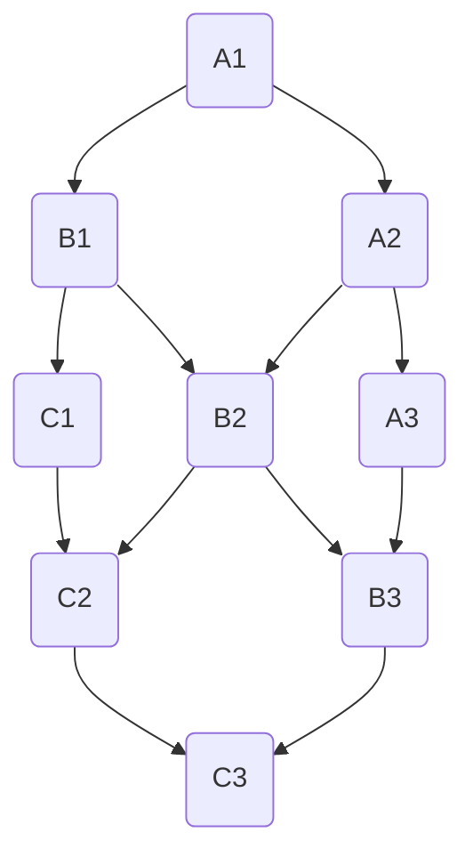
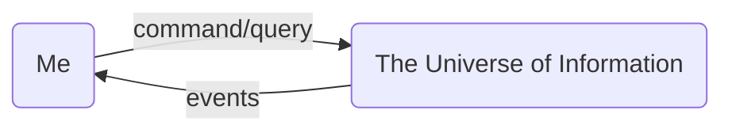

# cim-start
A starting point for CIM - Composable Information Machine.

 

We are creating an intuitive, private information system.

I am sure you have seen information presented in one of these:

 

Spreadsheets... Rows and Columns...

What if everything isn't rows and columns?

CIM is a systemized graph of information, every node and edge has a single purpose, designed for composition. 
We are transitioning from the world of Location-based Hierarchical Files, Rows and Columns, to something else. 

Rows and Columns are a construct, so are Graphs, but for some reason, we haven't gravitated to graphs as much yet.  They pervade social media and data science, but for reasoning, people still gravitate to browsing spreadsheets, or the equivalent of rows and columns from a database in much the same way. Why? there is no good reason, not performance and not the ability to understand. It's just a different way of looking at the same thing.

CIM can be huge, but usually starts small. A single configuration and we have a working, portable environment.

When it starts looking complex, remember we only ever need to understand this:

Looking at the spreadsheet, it is this in a graph:
Not terribly difficult to understand... and in many ways, easier to reason about

If you can put a formula in a cell on a spreadsheet, you can put one in the edge of a graph and they operate the same way.

One version of a CIM can look like this:

In a graph, nodes can represent a wide array of elements, from comprehensive operational systems like another CIM or your Document Repository, to simpler entities such as individual strings, collections of strings, constant strings, or even generators (such as sensor inputs).

In our domain context, strings are elevated beyond their basic form. Every word is imbued with meaning and semantic context, not merely in a broad sense but with the nuanced understanding akin to a child raised in a multilingual home. We employ various languages for distinct contexts, and the intersections of these languages highlight critical areas when conveying ideas. These intersections ultimately converge on a shared concept or context, revealing the underlying pattern we aim to uncover.

Previous endeavors might have explored similar ideas, but CIM adopts a unique approach by moving away from the conventional structure of rows and columns towards a graph-based model. This transition allows for a more dynamic representation of data. While the option to present data in rows and columns remains, the core structure of our domain shifts to a graph. This change doesn't render traditional databases obsolete; instead, it offers a fresh perspective on how we interact with data.

CIM is set to quickly advance us into a future where information is inherently connected, enhancing our ability to understand and utilize data effectively.

Another way to look at a more developed CIM Graph, here we are connecting a Leaf Node to a Domain Cluster:

Traditionally, we have a hundred things to think about just to get started. Let's start in the middle, with a browser and a git repository. This structure is all we need for a CIM, but we will quickly outgrow it as we proceed. We will just want more capability and to add that, we need to consume more resources.
  
CIM ia a massive abstraction, we need to get rid of the technology noise. The tech is still there, it's just sent to the background so we can focus on the information and not all the ways we can process it.  We know we can process it, making the decision how has now become the fulcrum for a successful information system.

CIM has 3 things:
  - Command: 
    - Change the State of the CIM
  - Query: 
    - Observe the current State of the CIM
  - Event: 
    - Declare the CIM has changed State

Everything evolves from that idea.
  - Who owns this?
  - Where do I store the Events?
  - What can a Command do?
  - How do I ask questions?
  - What are all the dependencies?
  - Where are my files?

These are all reasonable expectations from an Information Machine. The idea was supposed to be simple, but somehow it has exploded into a million acronyms we cannot understand.

We return to the simple, but that doesn't equate to less capable, in fact it becomes quite the opposite.

The way we generally think of "computers" is really some sort of glorified calculator that can hold and work with my information.  We all know they can do more, but they have been relegated to number crunchers and not semantics.

Humans are semantic creatures. We apply meaning to everything, consciously or subconsciously, we do it, it is engrained into how our brain works.  For some reason we still don't treat our information agents that way.

To simplify this let's look at a graph:

And this loop cycle just continues as we process information.

I need a way to pre-process things so I am not the engine.

This is what a CIM does, it let's me interface to everything I interact with. In the past this was nearly an impossible feat, but technology has brought us to a point where it is not only possible, but a distinct advantage to move to right now.

Some of the technologies we use will have a fairly steep learning curve to become an expert. Using the system and learning as we go is an intricate feature of the CIM.

Queries to AI about anything in the CIM is already built in, we just have to connect it to something that makes sense. Conversations are turned into Resources similar to having a recorded meeting with AI Agents.

This eliminates most of the steepness of the learning curve if you have a ready made assistant to help you and one that builds its own synaptic references in the background.

Even if you have never heard of any of these technologies, follow along. CIM will help you through Sage, a User Interface designed for designing and working with information.

Let's be distinct, we will talk about a lot of technology along the way, but we are concerned about the Information and how it applies to my Domain model over any particular preference for technology. If you hate NixOS and want to use Docker with Ansible instead you can absolutely do that, we've done it, and that is why we came to NixOS in the first place.

We have tried several combinations over the past decade:
SOA...
VMWare...
Radius...
Docker...
OpenStack...
Kubernetes...
Multipass...
Cloud-init...
DHCP/PXE...
SystemCenter...
Ansible...
Terraform...
Puppet/Chef...

It's a big list, and we have tried a bunch more including homegrown solutions, they all have pluses and minuses.

We certainly don't expect you to abandon your tools... CIM is a new tool, with a new purpose. It resides along with everything you already know as part of your Domain.

We start with 2 things:
  - Domain: a boundary around a collection of related information
  - Environment: some configured place for work
  
We need to start here because everything we add or build into the next stages become part of the language of our Domain.  We do start with a based language and the knowledge of what nomenclature is used in a Domain, so we have a starting reference, from there is is all dependent on what you add to your Domain.

CIM conveniently extracts a language tailored to your Domain and how you use it. It's like the dialect you use in your home as opposed to writing a speech.

This would be incredibly difficult to do manually, but there have been many successful ways to do this in the past, such as the zettelkasten method. We learn from and build upon those ideas.

Rather than impose this on you to manually recreate, the CIM will extract from everything you build and re-process it to create a language for your own use, but also for connecting semantically to Large Language Models and future AI capable processors.

Start by cloning this template repository and then open the folder

[using the template](./Using_this_template.md)

Copyright 2024 Cowboy AI, LLC