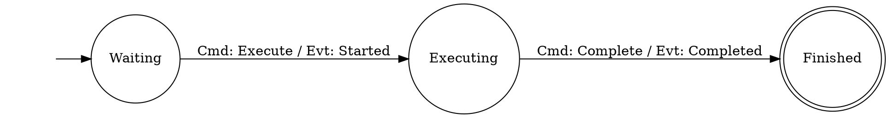
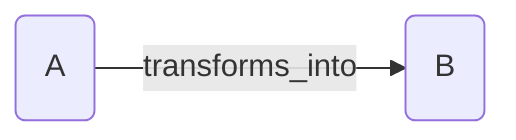
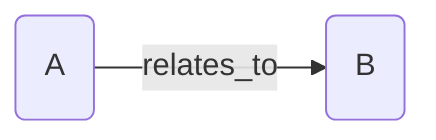
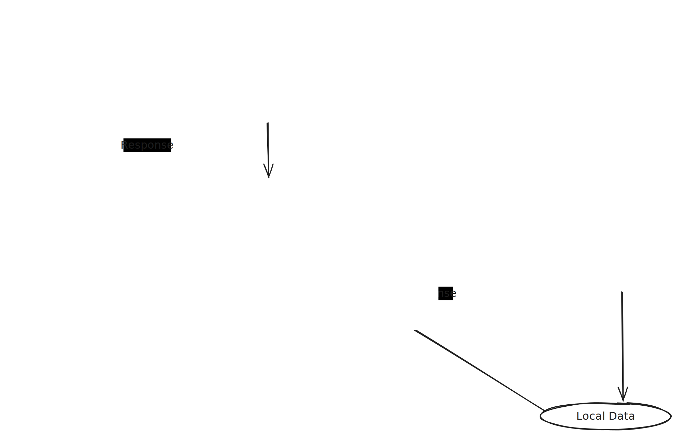
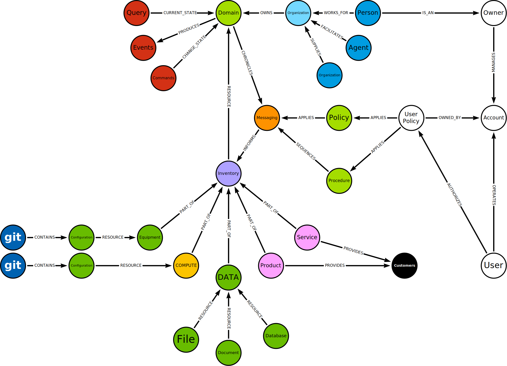
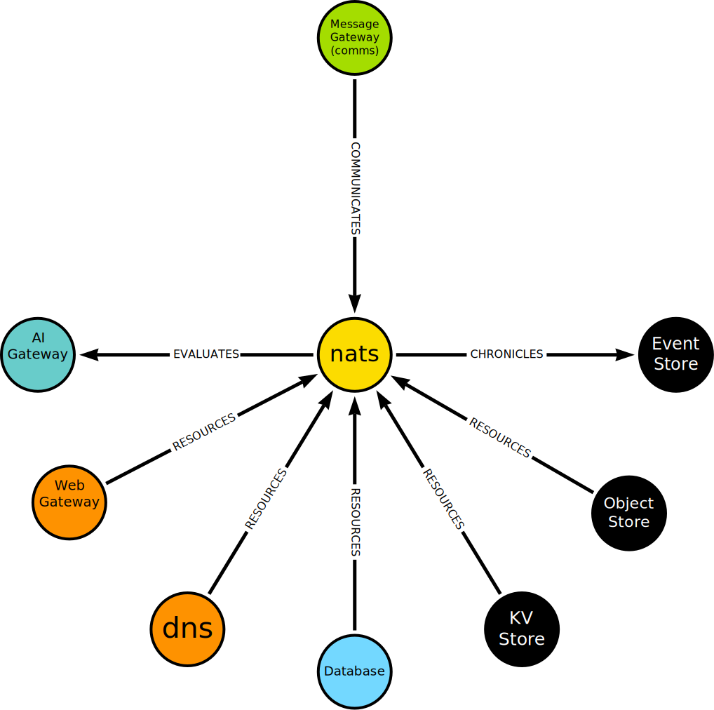

### Introducing CIM: The Future of Information Automation

#### Composable Information Machine by Cowboy AI

#### The Vision Behind CIM
- **Intuitive & Private Information System**: I want an universal information system that prioritizes user intuition, sensory reflection, and data privacy.
- **Business and AI**: With AI's ability to quickly extract information and produce fully tested code, businesses can accelerate their digital transformation, integrate diverse systems more efficiently, and harness the full potential of their existing applications in conjunction with AI Agents, and AI-driven self-improvement models.
- **Redefining Data Organization**: Moving beyond traditional applications, APIs and databases to a fully distributed and connected system that adapts and evolves like a living organism, offering a new DNA for information architecture.


<p>*Cowboy AI streamlines information integration and management.*</p>

<h1>*** CAUTION ***</h1>
<p>This repository is HIGHLY unstable and incomplete.</p>
<p>Version: 0.7.0</p>

<p>Please don't let this discourage you. This repository is rapidly changing, we are just issuing a word of caution that you may not want to use this in a production system without a great deal of testing and validation.</p>

<p>We have issued this repository in it's current state intentionally to invite community submissions and involvement in the MIT Licensed version of CIM.</p>

<p>There is a great deal of proven mathematics and computer science involved in this architecture and it is a challenging set of rabit-holes for you to explore. This is a very deep and philosophical model that truly takes a while to totally comprehend.</p>

<p>The difference out-of-the-box here is not a revolution in how we setup computers or infrastructure, but rather how what we wish to accomplish with these devices can be constructed in a reliable, repeatable, evolutionary way.</p>

<p>Information Systems by their very nature should be able to immediately tell you about themselves... Try that on any "command line interface" and you will find it quite challenging without already "knowing" where things are. Sorry, `manpages` are not intuitive at all.</p>

#### A New Way to See
- **Challenge the Status Quo**: Traditional information such as spreadsheets and word processing documents have limitations in flexibility and connectivity.
- **A New Paradigm with CIM**: Introducing a dynamic, interconnected approach.
  

<p>*Most of us are familiar with a spreadsheet.*</p>

THis is a paper paradigm...
Why are we still using paper paradigms on digital screens?
Forms, Really??? How 19th Century.

Cowboy AI moves beyond this notion to focus on state machines and relationships.


#### Moving things around
Information should be portable, accessible and flexible.
Storing information shouldn't require my personal, proper allocation into a library system complete with personal "tagging" to hopefully add sematics to my ability to find things. That is where "information systems" differ from "computer systems".

Computer systems are now commodity systems we can obtain and use with off-the-shelf components.

Information systems on the other hand, will always be tied directly to one or more Domains. They are concerned with how what information "is" and how it is related and sequenced rather than where it is and how we compute it.

#### Scalability and Simplicity
- **Start Simple, Scale Smartly**: We begin with a basic setup, designed to grow and adapt to your needs.
- **Maintaining Core Simplicity**: Despite its complexity, CIM remains accessible and manageable.


--- OR ---


>*This is the entire idea.*

It absolutely does not matter what A or B are, we just want to know they are related. Many relationships will appear and they will become overwhelming quickly.

We have a very clean solution to this with graphs.


#### A Diverse Ecosystem Within Nodes
- **Rich Data Representation**: Nodes can embody anything from complex systems to simple data types, offering a versatile foundation for information processing.
- **Language and Semantics**: Focus us on the importance of context and meaning in information, transcending traditional data dump storage methods into live, semantic construction on a running Domain.

 
*CIM represented as a microservice*

While this is not the *typical* architecture, it shows a representation most people who have seen some type of microservice can comprehend.

#### The Core of CIM: Dynamic Data Interaction
- **Foundation in Flexibility**: Coordinating with workfloes, static databases, web-based telemetry, and live interaction: we transform our view through through a dynamic, eventsourced, graph-based model.
- **Seamless Information Interconnection**: Aiming for a future where data is effortlessly linked, understood and processable.

 

*CIM Default Architecture*

The CIM Default architecture is a starting point to develop a Domain that will have it's own Ecosystem and Language.

Language is developed through relationships and vector transformations as events occur. New concepts become immediately accessible for review and testing in the domain.

#### Simplicity Amidst Complexity
- **Focusing on What Matters**: Prioritizes essential information over technological intricacies.
- **Core Functions**:
  - **Command**: Modify the CIM state.
  - **Query**: Access the current state.
  - **Event**: Notify changes within the system.

*Understanding and leveraging data through straightforward yet powerful interactions.*

*See worflows in straight-forward businss terms.*

#### Semantic Processing: Bringing Meaning to Data
- **Beyond Numbers**: Recognizing the semantic depth and potential in your tools.
- **A Graph of Understanding**: Simplifying the complex loop of command, query, and event for clear, meaningful interactions. Isolate a single transaction and branch from there when exploring your information.


*Clarifying the flow of information for intuitive system navigation.*

---

#### Integrating Technologies with CIM
- **Learning and Adaptation**: Built-in AI assists and guides you through the system, making it accessible regardless of technological proficiency. No more long training sessions, ask question as you work.
- **Technology Agnostic**: Supports various technologies, enhancing rather than replacing your current systems. Whether it is "legacy" technology, or some "special case" we can adapt to it and bring it into a logical, reactive part of your ecosystem.

*Making advanced technologies approachable and useful for everyone.*

#### CIM's Foundational Concepts
- **Domain and Environment**: Defining the scope and workspace for your information system.
- **From Zettelkasten to AI**: Automating domain-specific and human language creation and interaction, enhancing communication and efficiency.
---

#### Get Started with CIM
- **Explore and Expand**: Begin by cloning this template repository and discover how CIM can transform your domain.

```bash
git clone https://github.com/thecowboyai/cim-start
```

### Expanded CIM Structure
 

### Contributions
Code Contributions will be accepted through Pull Requests.
We don't have a guide up yet, but it is forthcoming.

*Copyright 2024 Cowboy AI, LLC*
MIT License