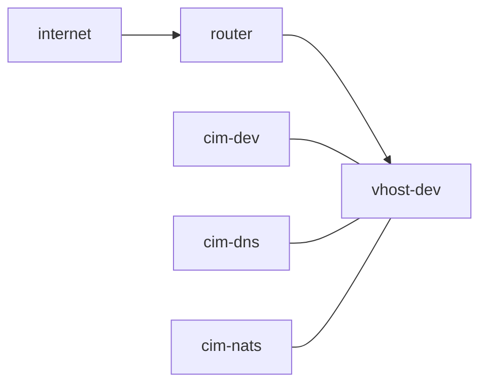

# Building an x86 Virtual Host
Ideally, this is a stand alone system.
We will start with that assumption.

What it is:
  Dell Precision 7920
    0.5TB ssd on nvme0
    1.0TB ssd on nvme1
    128G RAM
    4 Ethernet Ports
    1 Wifi Port

  8 port Ubiquiti Switch

  1 Starlink Terminal with Wifi

When we boot, to get internet access we need to connect to Starlink.
Setting up Starlink is beyond the scope of this document, but if you need it, [look here](./starlink)

Our development system looks like this:



We will be starting vhost-dev and booting from usb.

We expect Starlink to be available.

build the system
```bash
./build.sh
```

the iso is in result/iso, copy it to a usb drive
```bash
sudo dd if=./result/iso/nixos-24.05.20240425.7bb2ccd-x86_64-linux.iso of=/dev/sda bs=4M status=progress conv=fdatasync
```

boot it.