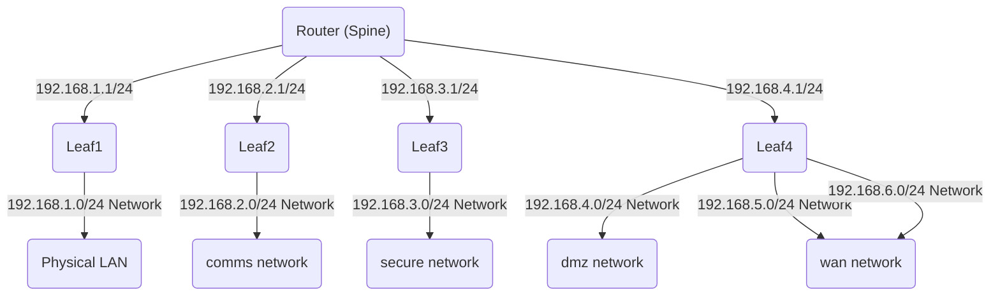

# Networking
What used to be a secondary item has now become primary.

In a CIM, we never have a single "machine" with a single address.

This system sees the network first. Nothing can communicate without it.

This means a bunch of numbers getting translated to names and back.

Essentially it is a fancy way to manage groups of numbers.

In our hardware scenario we have one external pipeline to the internet (represented by a single number) and one internal pipeline to the private network (represented by a whole bunch of numbers in separate groups). Our vhosts act as Leafs in a Leaf-Spine architecture.

This is a lot to manage and tooling is sparse around where to start and how to create this network design from scratch.  We don't want to rely on a specific vendor's flavor of this architecture.

In networking, it all breaks down to a packet, which is a header, a payload and an end.
Where the payload is originated and where it is to be delivered all reside in this header in various flavors. The payload is supposed to be delivered immutably, meaning you should not change it in flight.

We will be doing all this transparently at every network level.

A "Network" is a map of names to numbers and how to connect between them. 

[container] --> [vhost] --> [leaf] --> [switch]  --> [router]

The network is all the arrows.

We want a robust way to design our system so that it can start small, but scale massively if necessary. Most of our traffic is going to be "east-west" traffic, meaning all our internal machines need to talk to each other as quickly as possible.

We start with a single Public Access point and a single machine with 4 virtual leaves, containing 6 separate networks, linked together to operate as a single machine with separated parts.

This may seem like a very over-engineered way to use some equipment, but in fact it is a way to optimize how this equipment can connect and operate at it's best potential.

For virtualization, we aren't going to reinvent the wheel, we are using [Open vSwitch](https://www.openvswitch.org/) [Why?](https://github.com/openvswitch/ovs/blob/main/Documentation/intro/why-ovs.rst) The answer is that Open vSwitch is targeted at multi-server virtualization deployments, a landscape for which the previous stack is not well suited. For us, it is precisely what we need.

The Private address space is not really arbitrary.
We have:
- 10/8
- 172.16/12
- 192.168/16
- 169.254/16

IP packets originating from or addressed to a private IP address cannot be routed through the public Internet.

That means we have to translate what goes in and out between these address spaces.

We want to design a network where individual responsibilities have a boundary around them.

We will have one physical network to start and several virtual networks:
ILO - "Integrated Lights Out" network for configuration
Lan - local physical traffic
Agent - AI Agent network
Secure - Internal private network
Comms - Internal Messaging
DMZ - Relayed to the Public
Management - a separate management network to talk to hardware devices

This is somewhat complex...

We need the following:

Ilo: 192.168.0.0/24
Lan: 192.168.1.0/24
Comms: 192.168.2.0/24
Internal: 192.168.3.0/24
DMZ: 192.168.4.0/24
Agents: 192.168.5.0/24
Mgmt: 192.168.6.0/24
Wifi: 192.168.7.0/24

This is a bunch of addresses, will keep us separated and allow for some growth. It also puts some hard limits on traffic boundaries.

now what is the overall network space... it's actually 192.168/21.

2,048 IP4 addresses. We want enough to do what needs to be done, but not over-allocate and cause extra work for the switches.

We can do more separation and hardening as we need it.

We put these into [network.yaml](../../../domain/network.yaml)

We will have to manage all the IPs we are going to assign...
What goes into which network and what are the routes and rules...
What names match what IP and how do we derive that name?
These are all just nix and yaml files. We don't actually want to manage these by hand.

Managing is going to be messy, but fortunately, we are just templating here and it will be much easier than handwriting all these network files.

We have to decide ahead of time, where everything on these networks lives and what their address is... We need a physical address too.

This means we are going to have to manage the following:
- Network Space:
  - 192.168/21
- Ethernet Ports:
  - mac address
  - IP addresses
- Traffic Rules

This is all going into nix and yaml files. We scale this to databases as needed. What we are after here is the inital point of origin, then any changes just get added to that as events.

In our hardware definitions in [parts.yaml](../../../domain/parts.yaml) we capture the mac addresses of each port. We will need these for the network.

Our VHost will get 4 physical addresses and the containers will live in a few separate networks that will all need to translate to these physical ports.
We want to remove all the magic that does this and understand it explicitly.

We have turned off things like NetworkManager and wpa_supplicant and opt to turn all this on ourselves and handle virtualization with Open vSwitch.

It's a bit more mapping, but we are no longer relying on dynamic generation of connections we should be mapping out explicitly.

Almost everywhere this simply means:
[ip] --can_connect--> [ip]

What is now managing that is us, not some software on a vendor's router that runs DHCP.

We ultimately want to know that this thing is plugged into the physical network and I can talk to it with this physical id.
If this thing is not authorized... do something
If this thing is authorized... do something else

Usually this will involve executing a program somewhere and we need universal control of that.

We are controlling the entire internal network for the cim.

To bootstrap ourselves, we picked some networks, now we need to connect them in a strategic way and set all the rules to make it work.

The physical network is straight forward and if you have ever connected a network it will be very familiar.

I have a single machine with 4 ports, we simply define all those ports and plug them into a switch.

Virtual networks is where we get creative.
We have 7 networks (8 actually, but 192.168.0 is reserved and not used yet) that have various levels of ability to communicate with each other and the internet.

The Physical network is 4 networks and everything on it can talk through the physical connections...
for example:
Lan: 192.168.1.0/24
  - vhost-dev
    - eth0
      - 192.168.1.100
    - eth1
      - 192.168.2.100
    - eth2
      - 192.168.3.100
    - eth3
      - 192.168.4.100
  
  This physical network has internet access, but it only goes through lan...

  ## Spine/Leaf
  A typical Spine Leaf architecture consists of 2 Spine Switches and several Leaf Switches... For us this looks like this:

              Spine1     Spine2
            
            Leaf1 Leaf2 Leaf3 Leaf4

Where all these are connected to each other.
It is an optimal way to design datacenters, which a CIM is an example.

This allows for separate networks, low latency and scalability (expansion)

Our two spine switches are physical
The Leaf Switches are created from the Ethernet Ports on VHost-dev.

All the Leaf Switches are Virtual, using Open vSwitch.

Containers across the ecosystem will connect to these Leaf Switches.

This sounds difficult and it isn't... Spine1 connects to Spine2, Spine1 connects to all 4 Leaves, Spine2 connects to all 4 leaves... now everything is interconnected physically and we can control everything through software. It also allows for rerouting if a connection fails. We aren't going to talk about things like "air-gaps" yet and how to contend with that.

Security is all done at a very low-level and network segmentation is inherently built-in.

Once we interconnect the two spines and connect the 4 ethernet ports of vhost-dev, everything else is software.

The wires from ethenet ports on vhost-dev to spine1 and spine2 are L2 trunk lines.
Meaning they will carry traffic for potentially more than one network which are separated by the leaves.

Yes, we are turning vhost-dev into a virtual router. The advantage with this approach is how we are going to be managing our containers... and I use containers loosely here, that means any virtual container, be it a vm, lxc, docker, kubernetes, nixos-container, or something else.

We can place a container on any vhost, give it an IP for any configured network, and it will communicate over the correct network. 

So we need to set up this:

Spine1: L2 --> Leaf1
Spine1: L2 --> Leaf2
Spine1: L2 --> Leaf3
Spine1: L2 --> Leaf4

Spine2: L2 --> Leaf1
Spine2: L2 --> Leaf2
Spine2: L2 --> Leaf3
Spine2: L2 --> Leaf4

The spines are two 8 port switches, simply wire port 1 to port 1 on each
We will setup the management network in a bit, for now we just need a physical wire connected.

so in reality it is:
Spine1: L2 --> trunk1 --> Leaf1
               trunk1 --> Leaf2
               trunk1 --> Leaf3
               trunk1 --> Leaf4

Spine1: L2 --> trunk2 --> Leaf1
               trunk2 --> Leaf2
               trunk2 --> Leaf3
               trunk2 --> Leaf4

Spine2: L2 --> trunk3 --> Leaf1
               trunk3 --> Leaf2
               trunk3 --> Leaf3
               trunk3 --> Leaf4

Spine2: L2 --> trunk4 --> Leaf1
               trunk4 --> Leaf2
               trunk4 --> Leaf3
               trunk4 --> Leaf4

### Create the leaf switches

on vhost-dev the leaves are configured in network.nix

So far, we have talked about the numbers, but not names, or how those get into our Domain Name System.

Opening [dns configuration](../../../compute/dns/configuration.nix) reveals where the names are stored... in Undound, a dedicated nameserver.

We can populate this manually, but after a few dozen machines that becomes hard to manage so we have automation that does this and checks it for us.

We want the following to be automated:

Mac Address Discovery
L2/L3
IPAM:Port Management
DNS

What any of that really means:

[internet] --> [packet] --> [gateway] --> [ip]
and how we get there...

Entire Empires have been built on trying to achieve this...
We had to simplify it and not be proprietary so that was a bit of a challenge we needed to overcome.

We will have two things to work with, a Domain Name, which is the way we tsalk to these things, and IP Address, where they are in the internet.

If we manage everything by name, we can automate all the translation to numbers.

This will allow us to offload that task, simply by picking a top level range and let the CIM deal with everything else.

So we have picked 192.168.0.0/21

I need to divide that into 8 subnets
192.168.0/24
192.168.1/24
192.168.2/24
192.168.3/24
192.168.4/24
192.168.5/24
192.168.6/24
192.168.7/24

These ranges all have standards which we will apply:
x.x.x.0 is the network for this range
x.x.x.1 is the gateway for this range
x.x.x.254 is the nameserver for this range
x.x.x.255 is the broadcast address for this range

We don't want to repeat this for every network, they are all the same, but the configuration files on each machine will need them generated correctly.

# Network Business Rules
Communication between networks false down to business rules.
We have to store these somewhere they can be invoked and not have to worry about the hardware being attached... The hardware deployment is a separate process. Sometimes it means a human sits at a terminal and duplicates infornmation until tests pass. We want as few of those as possible.

# Containers and CNI

  Containers on the other hand, are only allowed to talk in their own network and that network may or may not be able to talk to other networks.
  
  DMZ can accept and reply to the internet, but it can't go look into the private networks. Some of the private networks can push to DMZ, but DMZ can't push to them.

  We have to manage all those rules in nix.

  So we will end up with 3 nix files to manage...
  - physical_network.nix
  - virtual_network.nx
  - firewall.nix

These will apply at different levels, but basically all get loaded onto vhost-dev for now. As we add cloud resources, we get more networking stuff.

There are a bunch of ways to manage this, but with nix, we are sticking with kernel resources for now, if we want to add middleware, we can, but we don't need it yet.

We need to map some networks and the kernel can already do all that for us.

