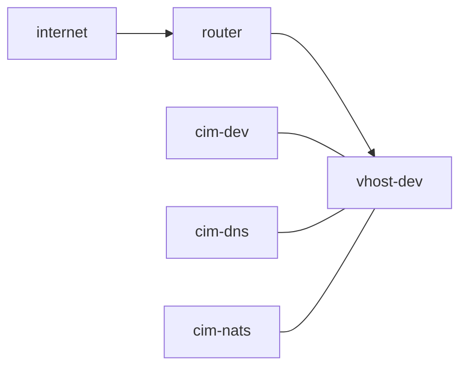

# Building an x86 Virtual Host
Ideally, this is a stand alone system.
We will start with that assumption.

What it is:
  you: on the same network as vhost-dev
      meaning you turned wifi off and plugged into the switch

      after plugging into the switch, verify that you have a router and internet access
      [setting up routing](./routing.md)

  Dell Precision 7920
    0.5TB ssd on nvme0
    1.0TB ssd on nvme1
    128G RAM
    4 Ethernet Ports
    1 Wifi Port

  Ubiquiti cloudKey

  8 port Ubiquiti Switch

  1 Starlink Terminal in bypass mode

  connected to:

  Ubiquiti Security Gateway on wan port
  lan port connects to the switch

When we boot, to get internet access we need to connect to Starlink.
Setting up Starlink is beyond the scope of this document, but if you need it, [look here](./starlink)

Our development system looks like this:



We will be starting vhost-dev and installing with nixos-anywhere.

We expect Starlink to be available.

## Deploy the system:
- Plug vhost-dev into the switch
- boot vhost with any live iso
- verify the network port is connected to 192.168.1.100 or change it in deploy.sh
- ssh into vhost-dev to verify connection
- disconnect ssh
```bash
./deploy.sh
```

When it reboots, veryify you can connect via ssh.
then verify it can connect to the internet
disconnect and proceed to establishing the Domain on a new CIM.

### What went wrong?

It didn't reboot into a system.
  - verify the modules being loaded are correct

It doesn't have a network
  - verify network setting in gnome

There is no gnome
  - something when wrong with the installation, rerun it

## It's all great and I can login as cim
Perfect.

Now we have remote control of our domain, sort of.
We need to establish the working Domain and setup communications.

We also would like to not clober everything next time we make an update to vhost-dev.

I really don't want to kill the disks and reload everything to add cowsay.

so let's take care of that first.

from now on, we use:
```bash
./rebuild.sh

```
just to be sure, we run it.

This should just rebuild the same system, but not clobber the disks.
I have had issues with ssh not working correctly and needed to tweak the configs.

root password doesn't seem to be getting set either so we need to handle those problems.

